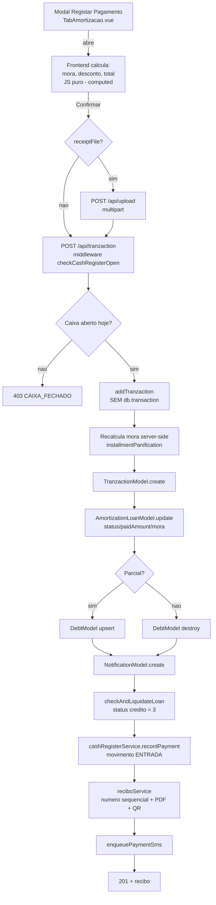
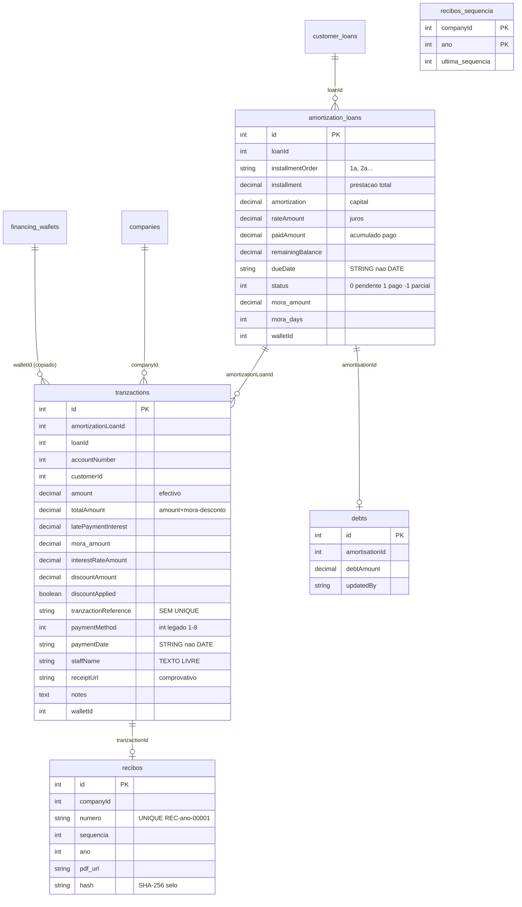

# AUDITORIA DO MÓDULO DE PAGAMENTOS — MBR Microcrédito

> **Auditoria READ-ONLY** — nenhum ficheiro de código foi alterado.
> Data: 30/09/2026 · Âmbito: fluxo de pagamento de prestações (modal "Registar Pagamento"), liquidação total, mora, recibos e caixa.
>
> **ACTUALIZAÇÃO — GERADOR DO PLANO FECHA AO CÊNTIMO + TAXA ADMINISTRATIVA 0,01% (implementado)**:
>
> **`simulator` (src/utils/loanAmortization.ts) reescrito** — o bug: cada coluna era arredondada independentemente (`round(amort) + round(juros) ≠ round(prestação)` em 8 de 18 linhas do crédito #67; ex. 7145,42+2859,89=10005,31 vs 10005,32) e o ajuste da última linha não fechava nem a linha nem o capital (Σ=149999,99). Novas garantias: prestação arredondada 1× e IGUAL em TODAS as linhas; amortização teórica (prestação teórica − juros teóricos) arredondada por linha com a diferença acumulada na ÚLTIMA parcela (Σ amortização = capital exacto); juros = prestação − amortização (a LINHA fecha sempre); consequência exacta: Σ juros = n×prestação − capital. Crédito #67: Σ = 150 000,00 / 30 095,76 / 180 095,76 — tudo fecha. Linhas existentes do crédito #67 (todas por pagar) reparadas na BD com o novo gerador.
>
> **Taxa administrativa 0,01%** — `administrativeFee` era `DECIMAL(15,2)`: um 0,01% (0,0001) era arredondado a ZERO ao gravar, e o modal de aprovação marcava o crédito como "Isento". Migração condicional (`modifyColumnType`) para `DECIMAL(15,6)` em `interest_rates` e `customer_loans` (aplicada no arranque); modelos Sequelize actualizados; inputs de taxa com `step=0.001` e formatação com 3 decimais (`formatPct`) em `RatesSection.vue`, `RatesPanel.vue` e modal de aprovação (que já usava 3 decimais). Validado E2E: taxa 0,0001 criada/actualizada por API e 0,00001 por UI, persistência exacta, aplicação ao crédito via PUT /api/loan/:id.
>
> **ACTUALIZAÇÃO — RECIBO 100% BACKEND-AUTHORITATIVE (implementado)**: o recibo fiscal é hoje emitido **exclusivamente no backend**, dentro da transacção SQL do pagamento (`emitReciboInTransaction` — passo 15 de `addTranzaction`): numeração sequencial com `FOR UPDATE` em `recibos_sequencia`, selo SHA-256 + QR Code (AT), PDF pdfkit gravado em disco e audit_log `RECIBO_EMIT` com userId+IP — tudo no mesmo commit; se o PDF falhar, o **pagamento inteiro sofre rollback** (nunca existe pagamento sem recibo). O frontend deixou de ter qualquer gerador de PDF: a dependência `pdfmake`, `utils/pdfMake.js`, `utils/pdfHeader.js` e `utils/legalDocs.js` foram **removidas** (grep `pdfMake|vfs_fonts|virtual-fs` = 0 em `web-app-v2/src` e no bundle `public-v2`), eliminando o erro `virtual-fs.js:37` que rebentava a impressão do recibo. Consumo frontend: `GET /api/tranzactions/:id/recibo` (JSON com `pdf_url`) → `ReciboViewerDialog` (PDF por blob, token de sessão); botão **Baixar Recibo** no modal de sucesso do pagamento; relatórios tabelares passam por `POST /api/reports/table-pdf` (pdfkit no backend); documentos legais (contrato/termo/garantias/extracto) por `GET /api/loans/:loanId/documents/:tipo/pdf`. Recibos antigos sem PDF: job `src/jobs/regenerateOldReceipts.ts` (arranca 20s após o servidor) + regeneração on-the-fly em `GET /api/recibos/:id/pdf`. Testes: `npm run test:payments` 24/24 (incl. suíte "RECIBO LEGAL": recibo+hash+PDF na transacção, PDF em disco, `RECEIPT_ALREADY_ISSUED` na edição, validação de hash, idempotência). Cleanup de testes apaga apenas recibos cujo pagamento é `TEST-%` — nunca toca em recibos reais nem abre buracos na numeração fiscal.

> **ACTUALIZAÇÃO — DOCUMENTOS LEGAIS DO MUTUÁRIO EM 2 FLUXOS SEPARADOS (implementado)**:
>
> **FLUXO 1 — Pacote de Concessão (IMUTÁVEL)**: gerado 1× por crédito, automaticamente após o desembolso (hook em `AmortizationController.createAmortizationLoan`, best-effort) ou via `POST /api/loans/:loanId/concession/generate`. Contém 4 PDFs (termo de compromisso, declaração de garantias, contrato de concessão, plano inicial) gravados em `uploads/concessao/<companyId>/<loanId>/`, com hash SHA-256 (loanId + bytes dos 4 PDFs) persistido em `concession_packages` (loanId UNIQUE), QR de validação por crédito em `uploads/recibos/<companyId>/<loanId>/QR-PACOTE.png` e audit `CONCESSION_EMIT`. Regeneração devolve **409 `PACKAGE_ALREADY_ISSUED`** — imutabilidade por design (o documento assinado não pode mudar). Downloads: doc individual `GET .../concession/:key/pdf` (ETag=hash, audit `CONCESSION_DOWNLOAD`) e pacote `GET .../concession/zip` (ZIP próprio com CRC32, sem dependências novas). Backfill `generateMissingPackages(25)` 40s após o arranque para créditos activos/terminados sem pacote. Frontend: secção "Documentos de Concessão" em `TabDocumentosLegais.vue` (badge "Imutável · hash", 4 cards + ZIP completo).
>
> **FLUXO 2 — Extracto do Crédito (DINÂMICO)**: gerado on-demand a cada pedido (`GET /api/loans/:loanId/documents/extracto/pdf`; botão "Baixar Extracto Atualizado (PDF)" em `TabAmortizacao.vue`), nunca gravado no pacote. Reflecte o estado REAL do crédito à data de emissão: coluna Estado por prestação (PAGO com data do último pagamento, PAGO (PARCIAL), PAGO PARCIAL, ATRASADO, PENDENTE), mora acumulada, prestações em atraso, próximo vencimento; **TAEG** anualizada por bissecção (Σ prest/(1+i)^k = capital → (1+i)^12−1; ex.: 150 000 MZN, 18×, 2% a.m. = **26,82% a.a.**); arredondamento fechado ao cêntimo — a diferença entre o capital e a soma das amortizações arredondadas vai integralmente para a ÚLTIMA parcela, pelo que os TOTAIS fecham no capital exacto (150 000,00 e não 149 999,59). Landscape.
>
> Os dois fluxos **nunca se misturam**: o pacote é prova documental da concessão (estático, hash, QR); o extracto é fotografia corrente da dívida. Rodapé legal comum (`drawFooters`): header MBR (nome, NUIT, contactos, logo) + hash/QR + data/hora de processamento + paginação. Nenhum PDF é gerado no frontend.
>
> **Bug crítico resolvido (OOM)**: `doc.text()` do pdfkit com `width` **negativa** + `lineBreak:false` entra em **loop infinito** (crash por esgotamento de heap). Ocorria quando o "plano" renderizava em portrait (útil 515pt) com larguras desenhadas para landscape (soma 763pt) → última coluna com largura negativa. FIX: `LANDSCAPE_DOCS = {extracto, plano}`, `planWidths` com `Math.max(20, …)` e guardas que actualizam `ctx.contentBottom` após cada `addPage()` (rodapé do extracto com Y absoluto).
>
> **Validação (Conta 106 — Saide Ali Fargi, 150 000 MZN, 18×, 2%)**: pacote emitido (hash `712a7cf1…`), regeneração → 409 com mensagem correcta, 4 PDFs + ZIP 200 (HTTP), extracto com TAEG 26,82% e TOTAIS 150 000,00 (verificado com pypdf), Termo com "**declaro que Recebi** na data de hoje" (espaço corrigido), BI numa linha e checkboxes desenhados (cheque/numerário/transferência conforme `paymentMethod`). E2E no browser (:4000): aba Documentos Legais (downloads) e aba Plano de Amortização (extracto dinâmico) — consola limpa.
>
> As secções seguintes descrevem a análise da arquitectura anterior; os pontos críticos aí levantados (atomicidade, idempotência, lock de prestação, auditoria, unicidade de referência) foram implementados no módulo Pagamentos V2.
> Tela analisada: `Detalhe do Mutuário › Plano de Amortização › Modal "Registar Pagamento — 1ª"` (`/mutuarios/111`, crédito #82).

---

## ⚠️ Correcção prévia ao enunciado

A stack **não é Laravel**. O sistema é:

- **Backend**: Node.js + Express + Sequelize + MySQL (TypeScript em `src/`, compilado para `build/`)
- **Frontend**: Vue 3 + Quasar + Pinia + Vite (`web-app-v2/`, build servido pelo próprio Express em `public-v2/`)
- O print em `http://localhost:9000/mutuarios/111` é o **dev server do Vite** com proxy `/api → :4000` (Express)

Não existem Controllers/Livewire/Actions do Laravel. O equivalente é: **Route → Middleware → Express Controller → Service/Model Sequelize**.

---

## 1. Resumo Executivo

O módulo de pagamentos funciona numa arquitectura de **"frontend propõe, backend deduz"**: o modal Quasar calcula mora, desconto e total a pagar em JavaScript (Vue computed), envia o valor tecido e o backend **recalcula** a mora de forma independente (`installmentPanification`) e aceita o `amount` do cliente sem validar contra o saldo real da prestação. A operação individual (`POST /api/tranzaction`) **não corre dentro de uma transacção SQL**: cria a transacção, actualiza a prestação, gere a dívida, notifica, registra no caixa e emite recibo em **sequência de operações autónomas** — qualquer falha a meio deixa o estado inconsistente (ex.: prestação paga sem movimento de caixa, ou recibo sem transacção). A liquidação total (`POST /api/tranzaction/bulk`) **foi corrigida** e corre dentro de `sequelize.transaction` atómica — é o padrão que o pagamento individual deveria seguir.

As regras de microcrédito existem mas são rudimentares: a mora é uma fórmula única `Prestação × (forfeit%/dia) × dias corridos de atraso`, configurável apenas por empresa (coluna `companies.forfeit`, sem carência, sem teto, sem dias úteis), incidindo sobre a prestação **integral** mesmo depois de pagamentos parciais. A alocação de pagamentos parciais é implícita (abate o saldo da prestação, mora cobrada em separado) sem motor explícito Multa→Juros→Capital; excesso de pagamento é **silenciosamente descartado** (`Math.min(newTotalPaid, installmentValue)`) sem virar crédito para a prestação seguinte nem saldo do cliente; não existe estorno nem anulação de pagamento (o `PUT /api/tranzaction/:id` aceita qualquer `req.body` sem validação — risco grave de edição retroactiva de valores).

Em termos de compliance, o sistema **já tem** o que é mais difícil de acrescentar depois: numeração sequencial legal de recibos (`recibos_sequencia` com `SELECT ... FOR UPDATE` dentro de transacção), selo SHA-256 + QR Code de validação pública, e controlo de caixa diário obrigatório para movimentar dinheiro. Os pontos críticos em falta para nível bancário são: atomicidade do pagamento individual, idempotência/concorrência na prestação (sem lock, dois caixas podem pagar a mesma prestação em paralelo), trilha de auditoria com `userId`/IP (hoje só `staffName` texto livre), unicidade de referência de pagamento, e validação server-side rigorosa de valores e datas.

---

## 2. Fluxo Atual (End-to-End)

### 2.1 Diagrama do pagamento individual



**Cada passo de H→S é independente e "best-effort"** — os comentários no próprio código dizem "falha NÃO desfaz o pagamento". Se o processo morrer entre J e K, a transacção existe mas a prestação continua pendente (paga duplicável). Se falhar em Q, o caixa fica com menos dinheiro do que os recibos dizem.

### 2.2 Componentes tocados

| Camada | Ficheiro | Papel |
|---|---|---|
| Rota | `src/routes.ts:517-529` | `POST /api/tranzaction` + `checkCashRegisterOpen` |
| Middleware | `src/middlewares/checkCashRegisterOpen.ts` | Exige caixa aberto hoje (JWT decodificado aqui) |
| Controller | `src/controllers/TranzactionController.ts` (`addTranzaction`, ~300 linhas) | Orquestra tudo |
| Controller | `src/controllers/TranzactionBulkController.ts` | Liquidação total **com** `db.transaction` |
| Util | `src/utils/calculateLateAmount.ts` | Fórmula da mora |
| Services | `cashRegisterService`, `reciboService`, `SmsGatewayService` | Caixa, recibo legal, SMS |
| Models | `TranzactionModel`, `AmorizationLoanModel`, `LoanModel`, `DebtModel`, `NotificationModel`, `Recibo` | Tabelas `tranzactions`, `amortization_loans`, `customer_loans`, `debts`, `notifications`, `recibos` |
| Frontend | `web-app-v2/src/components/mutuario/TabAmortizacao.vue` | Modal, cálculos em JS, payload |
| Store | `web-app-v2/src/stores/mutuario.js` (`payInstallment`, `liquidateAll`) | Chamadas API |

**Nota sobre autenticação**: `routes.use("/api", auth)` em `routes.ts:401` aplica o middleware de JWT a **todas** as rotas `/api` (o pagamento está protegido), mas `req.user` não é populado pelo middleware `auth` — o controller de caixa volta a **decodificar o JWT manualmente** para obter o userId.

### 2.3 De onde vêm "Em falta", "Mora" e "Total a pagar" do modal

**Do backend via GET, mas recomputados no frontend.** O plano vem de `GET /api/loan/amortization/:loanId/:forfeit` (LoanController:249, `installmentPanification` server-side). O modal, porém, **recalcula a mora localmente** com a data escolhida pelo utilizador:

```js
// TabAmortizacao.vue:480-491 — Mora recalculada em JS a cada alteração de data
const paymentLateInterest = computed(() => {
  const inst = currentInstallment.value
  if (!inst || Number(inst.status) === 1) return 0
  const dueDate = new Date(inst.dueDate)
  const payDate = new Date(`${paymentForm.value.paymentDate}T00:00:00`)
  const daysLate = Math.max(0, Math.floor((payDate - dueDate) / 86400000))
  const forfeit = Number(companyStore.company?.forfeit) || 0
  return Math.round((Number(inst.installment || 0) * (forfeit / 100) * daysLate) * 100) / 100
})

// "Em falta" = prestação − paidAmount (linha 455)
const installmentRemaining = (inst) => Math.max(0, Number(inst?.installment || 0) - Number(inst?.paidAmount || 0))

// "Total a pagar" = Em falta + Mora (− desconto no modo discount) (linhas 492-504)
```

No print: Em falta = 33 000 (paidAmount = 0), Mora = 0,00 (data de pagamento 30/09/2026 ≥ vencimento 30/10/2026 → `daysLate = 0`), Total = 33 000. **O backend recalcula a mora de novo no POST** (bom), mas **confia cegamente no `amount`** vindo do form (mau — ver §5).

---

## 3. Cálculos de Mora Atuais (com trechos)

### 3.1 Fórmula oficial (backend — fonte da verdade fiscal)

```ts
// src/utils/calculateLateAmount.ts
const latePaymentInterest = (installment, fine, referenceDate?) => {
  const today = referenceDate ? moment(referenceDate).startOf("day") : moment().startOf("day");
  const diffDays = moment(today).diff(moment(installment.dueDate), "days");
  if (diffDays <= 0 || installment.status === 1) return 0;          // sem carência (grace period = 0)
  const dailyRate = Number(fine || 0) / 100;                        // forfeit 1 → 0.01/dia
  const installmentAmount = Math.max(0, parseFloat(installment.installment) || 0); // incide sobre a prestação INTEGRAL
  const dailyPenalty = installmentAmount * dailyRate;
  return Math.round(dailyPenalty * diffDays * 100) / 100;
};
```

**Parâmetros reais hoje (BD):**

| Empresa | `forfeit` (mora) | Efeito |
|---|---|---|
| MBR Microcrédito (id 36) | `1` | **1% ao dia** → 30% ao mês (!) |
| +Mola (id 2) | `0` | Sem mora |
| MicroMz (id 37) | `1` | 1% ao dia |

**Características da mora actual:**

- **Base de incidência**: prestação integral (não o saldo em dívida) — um pagamento parcial de 20 000/33 000 não reduz a mora futura
- **Dias corridos** (moment diff), sem noção de dias úteis
- **Sem carência** — mora começa no 1.º dia de atraso (`diffDays <= 0 → 0`, ou seja, vence no dia D → 0; D+1 → 1 dia de mora)
- **Sem teto** (cap) — 1%/dia compõe linearmente para sempre
- **Sem juros sobre juros** (linear, não composta)
- **Configurável só por empresa**, não por crédito, sem histórico de alterações
- **Deduplicação frágil**: o handler subtrai a mora já cobrada somando **todas** as transacções anteriores da prestação (`alreadyChargedLate`); se uma transacção antiga foi editada/eliminada, a mora recalculada fica errada

### 3.2 Deduplicação no pagamento individual

```ts
// TranzactionController.ts (addTranzaction)
const previousLateInterest = await TranzactionModel.findAll({ where: { amortizationLoanId }, ... });
const alreadyChargedLate = previousLateInterest.reduce((sum, t) => sum + (Number(t.latePaymentInterest) || 0), 0);
latePaymentInterest = Math.max(0, Number(calculatedInstallment?.latePaymentInterest || 0) - alreadyChargedLate);
totalAmount = Math.max(0, Number(amount || 0) + latePaymentInterest - Number(req.body.discountAmount || 0));
```

### 3.3 Ordem de alocação (pagamento parcial)

Não existe motor de alocação. Na prática:

1. `amount` (o que o cliente paga) → **abate o saldo da prestação** (`paidAmount += amount`)
2. `latePaymentInterest` → **cobrada em separado** (não entra no `paidAmount`), acumulada em `mora_amount` da prestação
3. Desconto → marca a prestação como paga (`isFullPayment = true`) e perdoa a diferença
4. **Não há** prioridade Multa > Juros mora > Juros > Capital — juros normais (`rateAmount`) já estão embutidos na prestação (Price), mora é campo separado

### 3.4 Excesso e antecipação

- **Excesso** (`amount` > saldo): `finalPaidAmount = Math.min(newTotalPaid, installmentValue)` — o troco **desaparece silenciosamente**. Não vira crédito para a próxima prestação nem saldo do cliente. O `totalAmount` gravado fica com o valor inflado, divergindo do caixa.
- **Antecipação**: não há recalculo de plano nem desconto automático por pagamento antecipado. O único desconto é o manual da liquidação total (`discountType: percentage|fixed` com rateio proporcional por peso da prestação) — em `bulk`, **dentro de transacção**.
- **Data retroativa**: permitida (só bloqueia futuro). Uma data retroativa **recalcula a mora para menos** (`paymentReferenceDate` retroactivo), mesmo que a prestação já estivesse em mora há dias — permite "apagar" mora acumulada registrando o pagamento com data antiga. Nada impede, também, registrar um pagamento de ontem **depois** de a mora já ter sido cobrada hoje noutro pagamento.

### 3.5 Estorno / Cancelamento

**Não existe.** `PUT /api/tranzaction/:id` faz `TranzactionModel.update(req.body, ...)` sem validação de campos, sem reverter `paidAmount` da prestação, sem estornar movimento de caixa, sem invalidar recibo nem reabrir a liquidação do crédito. É um vector directo de fraude: qualquer utilizador autenticado pode alterar o valor de um pagamento já emitido em recibo certificado pela AT.

---

## 4. Modelo de Dados (ERD simplificado, do código + `SHOW COLUMNS`)



**Status da prestação** (`amortization_loans.status`): `0` pendente · `1` pago · `-1` parcial. **Não existem** status "em mora" (é calculado on-the-fly por `dueDate < hoje`) nem "perdoado" (o perdão é um desconto que marca como `1` pago, indistinguível de um pagamento integral).

**Respostas pontuais:**

- **Referência única?** **Não** — `tranzactionReference VARCHAR(255)` sem UNIQUE nem índice próprio (só usado em LIKE de busca). Duas transferências com a mesma referência passam sem aviso.
- **Comprovativo**: `receiptUrl` (longtext) — ficheiro vai para `uploads/documents/` via `POST /api/upload` (multer, field `file`, **5MB**, mime: jpeg/jpg/png/pdf, nome com `randomBytes(16)_original`). Guarda em **disco local**, sem S3.
- **Auditoria**: `staffName` é **texto livre do form** (no modal vem pré-preenchido com `authStore.userName` mas **desabilitado apenas na UI** — o backend aceita qualquer string; no bulk idem). **Não grava** `userId`, **IP**, nem user-agent na transacção. Existe `logger.js` no frontend (logs de UI) e `POST /api/logs`, mas o controller de pagamentos **não escreve log de auditoria server-side**. Timestamps só de criação/actualização da linha.
- **paymentDate é STRING** (não DATE) — impossível indexar/validar range em SQL de forma fiável; os relatórios filtram por `createdAt` (datetime) em vez da data efectiva do pagamento.

---

## 5. Falhas e Riscos Profissionais (14 identificados)

| # | Risco | Severidade | Evidência |
|---|---|---|---|
| 1 | **Sem transacção SQL no pagamento individual** — 8 operações encadeadas best-effort; crash a meio deixa transacção sem actualização da prestação (pagamento duplicável) ou prestação paga sem caixa/recibo | 🔴 Crítica | `addTranzaction` (TranzactionController.ts:~370-660) — nenhum `db.transaction`; o bulk já tem |
| 2 | **Concorrência na prestação** — dois caixas pagam a mesma prestação ao mesmo tempo: ambos leem `paidAmount = X`, ambos gravam `X + amount`; sem `SELECT ... FOR UPDATE` nem optimistic locking, perde-se dinheiro do registo (segundo sobrescreve o primeiro) | 🔴 Crítica | `AmorizationLoanModel.update` com `paidAmount: finalPaidAmount` calculado a partir de leitura não-bloqueada |
| 3 | **`PUT /api/tranzaction/:id` aceita qualquer body** — permite editar valor/referência de pagamento já emitido em recibo certificado, sem reverter paidAmount/caixa/recibo → fraude e quebra de continuidade da numeração AT | 🔴 Crítica | `updateTranzaction` (TranzactionController.ts:529-538) |
| 4 | **Excesso de pagamento descartado silenciosamente** — cliente paga 40 000 numa prestação de 33 000: 33 000 gravados, troco some; `totalAmount` gravado diverge do dinheiro entrado no caixa | 🔴 Alta | `finalPaidAmount = Math.min(newTotalPaid, installmentValue)` |
| 5 | **`amount` do frontend confiado sem validar contra o saldo** — Inspetor do browser muda `amount` para 1: backend aceita, marca regra; mudar para negativo/NaN/undefined gera `totalAmount` inconsistente (só a mora é recalculada server-side) | 🔴 Alta | `currentPayment = Number(amount) || 0`; regra só existe no form (`val => val > 0`) |
| 6 | **Data retroativa recalcula mora para baixo e ignora mora já cobrada** — registrar pagamento com data anterior "apaga" mora acumulada; e um pagamento de ontem inserido hoje grava `mora` já cobrada hoje em duplicado lógico | 🟠 Alta | `paymentReferenceDate = paymentDate || today`; deduplicação soma transacções antigas |
| 7 | **Mora de 1%/dia sobre prestação integral sem cap** (empresa 36) — 30%/mês ≈ 365%/ano, muito acima dos limites práticos de usura; incide sobre a prestação cheia mesmo com 90% pago | 🟠 Alta (compliance) | `companies.forfeit = 1`; `latePaymentInterest()` usa `installment` integral |
| 8 | **Sem auditoria server-side de pagamentos** — quem registou fica como texto livre (`staffName`), sem userId, sem IP; backend não escreve em logs de auditoria; comprovativo opcional no pagamento individual | 🟠 Alta | `TranzactionModel` não tem `userId`/`createdBy`; `staffName: paymentForm.value.staffName` |
| 9 | **Referência de pagamento não única** — mesma referência aceita N vezes; sem verificação de duplicado por (referência + método + data), o erro de duplo clique/caixa dupla não é apanhado | 🟠 Média-Alta | Sem UNIQUE em `tranzactionReference` |
| 10 | **Sem idempotência** — retry de rede (timeout 15s do axios) re-submete o POST inteiro: cria 2.ª transacção e soma `paidAmount` de novo | 🟠 Média-Alta | Sem `Idempotency-Key` nem verificação de payload idêntico recente |
| 11 | **Mora calculada no frontend** com fórmula duplicada — se backend e frontend divergirem (ex.: mudar forfeit), o modal mostra X e o backend cobra Y; o do backend é que vale, mas a UI mente até ao submit | 🟠 Média | `paymentLateInterest` computed duplica `latePaymentInterest()` |
| 12 | **`paymentDate` como VARCHAR** — relatórios e mora dependem de `String(paymentDate).slice(0,10)`; formatos mistos (`YYYY-MM-DD` vs `DD/MM/YYYY`) quebram ordenação e filtros silenciosamente | 🟠 Média | `SHOW COLUMNS`: `paymentDate varchar(255)`; mesmíssimo em `amortization_loans.dueDate` |
| 13 | **Movimento de caixa com método errado** — `recordPayment` lê `req.body.payment_method` (snake_case) que **o modal nunca envia** (envia `paymentMethod` numérico) → cai sempre em `"CASH"` por defeito; transferências bancárias entram no caixa como numerário | 🟠 Média | TranzactionController.ts:~600 (`paymentMethod: String((req.body as any)?.payment_method || "CASH")`) |
| 14 | **Arredondamentos inconsistentes** — `Math.round(x*100)/100` espalhado à mão (mora, desconto, rateio do bulk); sem política única de centavos; DEDECIMAL(15,2) correto na BD mas cálculos em float JS podem gerar diferenças de 0,01 em rateios | 🟡 Média | `Math.round(... * 100) / 100` em ~15 pontos dos dois controllers |

**Sobre compliance AT (Autoridade Tributária de Moçambique)**: o recibo já tem numeração sequencial legal por empresa/ano (`recibos_sequencia` com `FOR UPDATE`), `UNIQUE KEY unique_numero`, selo SHA-256 + QR de validação pública (`/validar?rec=...&hash=...`) e certificação declarada "MBRM v2.0 Cert AT 2026/001". **Falta** (para o banco central/AT): não-permitir edição pós-emissão (risco #3), conservação imutável dos PDFs, e declaração formal da fórmula de mora nos contratos (1%/dia é defensável só se estiver no contrato).

---

## 6. Benchmark — Como deveria ser numa microfinança profissional (V2, só design)

### 6.1 Fluxo ideal de pagamento

1. **Cálculo server-side autoritativo**: `GET /api/installments/:id/payable-quote?date=YYYY-MM-DD` devolve `{ saldoCapital, moraAcumulada, moraNova, totalAPagar }` calculado pelo motor de mora — o modal passa a **mostrar** a quote do servidor (sem recalcular em JS). Mudou a data → nova quote.
2. **Submissão idempotente**: o POST exige `Idempotency-Key` (UUID gerado no abrir do modal). Repetição do POST devolve o resultado da 1.ª execução em vez de criar duplicado.
3. **Validação server-side de valor**: `amount` tem de estar em `(0, saldo+mora]` (excesso só com flag `acceptOverpay` que gera saldo a favor do cliente, nunca descarta troco).
4. **Transacção SQL única** (como o bulk já faz): tranzaction + prestação + dívida + alocações + caixa + recibo **no mesmo commit**; SMS/notificações best-effort pós-commit via fila.
5. **Concorrência**: `SELECT ... FOR UPDATE` da prestação dentro da transacção (ou coluna `version` para optimistic locking). Segundo caixa recebe 409 "prestação alterada por outro utilizador, refresque".
6. **Recibo automático PDF** (já existe) + **SMS ao cliente** (já existe) — manter, mas dentro do fluxo pós-commit garantido por outbox/fila com retry.
7. **Estorno formal**: `POST /api/tranzaction/:id/reverse` com motivo obrigatório + aprovação por role superior: reverte alocações, prestação volta a pendente, caixa recebe movimento SAÍDA, recibo original é marcado anulado e é emitido recibo de estorno referenciado. **Nunca** editar a transacção original.
8. **Fecho diário** (o caixa diário já existe — completar): conferência automática entradas caixa ↔ transacções do dia ↔ recibos emitidos; divergência bloqueia o fecho.
9. **Trilha de auditoria**: toda mutação grava `userId` (do token), IP, payload antes/depois, numa tabela append-only.

### 6.2 Estrutura de tabelas proposta (design, sem implementar)

```
payments                      — 1 registo por recebimento físico (o "dinheiro entrou")
  id, company_id, customer_id, method (enum CASH/BANK/MPESA/EMOLA/CHECK),
  amount_received, reference (UNIQUE por company+method), payment_date (DATE),
  proof_file_id, received_by (user_id FK), register_id (caixa), idempotency_key (UNIQUE),
  status (CONFIRMED/REVERSED), reversed_by, reversal_reason, created_at, ip

payment_allocations           — onde cada cêntimo do payment foi aplicado
  id, payment_id FK, amortization_loan_id FK, component (enum PENALTY/LATE_INTEREST/INTEREST/CAPITAL),
  amount, created_at
  → responde "quanto deste pagamento foi mora e quanto foi capital" sem parsing

penalties / late_accruals     — mora como registo, não como fórmula re-executada
  id, amortization_loan_id FK, accrual_date (DATE), days, base_amount, rate,
  amount, status (ACCRUED/CHARGED/WAIVED), waived_by, waived_reason
  → política configurável por empresa: forfeit %, base (saldo vs prestação),
    cap, grace period, dias úteis; geração por job diário (não no clique do pagamento)

installments (evolução de amortization_loans)
  ... , version (optimistic lock), status (PENDING/PARTIAL/PAID/WAIVED),
  due_date DATE, totals derivados de payment_allocations (paidAmount deixa de ser coluna "sagrada")

receipts (recibos)            — mantém o que já existe e é bom
  id, numero UNIQUE, serie, sequencia, ano, payment_id FK,
  pdf_file_id, hash, status (EMITIDO/ANULADO), annulled_by_receipt_id (self FK)

audit_log                     — append-only
  id, user_id, ip, action, entity, entity_id, before JSON, after JSON, created_at
```

**Migração mínima viável do actual para este modelo**: (1) envolver `addTranzaction` em `db.transaction` + `FOR UPDATE` da prestação — ganho máximo com risco mínimo; (2) gravar `userId`/IP; (3) bloquear edição (`PUT`) de transacções com recibo emitido; (4) rejeitar `amount > saldo` sem flag explícita; (5) mover `paymentDate`/`dueDate` para DATE.

---

## 7. Checklist — o que falta para nível Banco

**Integridade e Concorrência**
- [ ] `db.transaction` no pagamento individual (padrão do bulk) — R1
- [ ] `SELECT ... FOR UPDATE` da prestação / optimistic lock — R2
- [ ] Idempotency-Key no POST de pagamento — R10
- [ ] Rejeitar/exceder com política explícita o pagamento acima do saldo — R4

**Controlo e Fraude**
- [ ] Remover/fechar `PUT /api/tranzaction/:id` para transacções com recibo; criar estorno formal — R3
- [ ] Gravar `userId` (do JWT), IP e endpoint em cada pagamento (`audit_log`) — R8
- [ ] `staffName` derivado do token, não do body — R8
- [ ] UNIQUE (companyId, method, reference) + verificação de duplicado — R9
- [ ] Corrigir método do caixa (`payment_method` vs `paymentMethod`) — R13

**Regras de Negócio**
- [ ] Motor de mora: tabela de parâmetros (forfeit, grace, cap, base) + accrual diário por job — R7
- [ ] Alocação explícita Multa → Juros mora → Juros → Capital (`payment_allocations`) — §3.3
- [ ] Excesso vira saldo a favor do cliente / crédito próxima prestação — R4
- [ ] Política de data retroativa: permitir só com permissão especial e sem reduzir mora já cobrada — R6
- [ ] Fórmula de mora replicada do backend no frontend removida (usar quote API) — R11

**Dados e Compliance**
- [ ] `paymentDate` e `dueDate` para `DATE` com migração de formatos — R12
- [ ] Política única de arredondamento (centavos) documentada e testada — R14
- [ ] Conservação imutável dos recibos PDF + trilha de anulação
- [ ] Fecho diário com conciliação automática caixa ↔ transacções ↔ recibos
- [ ] Testes automatizados do motor de mora e alocação (casos: parcial, excesso, retroativo, Leap year, fuso)

---

*Auditoria realizada exclusivamente por leitura de código (`src/`, `web-app-v2/src/`), schema real (`SHOW COLUMNS`) e dados de configuração (`companies.forfeit`).*

---

# ✅ IMPLEMENTADO — PAGAMENTOS V2 (30/09/2026)

As 3 fases foram implementadas, migradas e **testadas (15/15 verde)** contra o MySQL local. Resumo do que entrou:

## FASE 1 — Blindagem imediata

| Risco (da auditoria) | Solução implementada |
|---|---|
| R1 · Sem transacção SQL | `addTranzaction` 100% dentro de `db.transaction()` — transacção, prestação, dívida, alocações e auditoria no mesmo commit; caixa/recibo/SMS pós-commit best-effort |
| R2 · Concorrência | `findByPk(..., { lock: t.LOCK.UPDATE })` na prestação; 2.º pagamento em prestação paga → **409 ALREADY_PAID** (testado) |
| R3 · PUT aberto | `PUT /api/tranzaction/:id` com 3 guardas: recibo emitido → **403 RECEIPT_ALREADY_ISSUED**; REVERSED → imutável; whitelist de campos (nunca valores monetários) |
| R3 · Sem estorno | `POST /api/tranzaction/:id/reverse` (só ADMIN userRole 0, motivo ≥10 chars): prestação reposta, transacção REVERSED, recibo ANULADO, accruals devolvidos a ACCRUED, customer_credits cancelados, movimento SAÍDA no caixa — tudo transaccional (testado) |
| R4 · Troco descartado | `amount > devido` → **400 OVERPAY_NOT_ALLOWED**; com `acceptOverpay=true` o excesso vai para `customer_credits` (nunca some) (testado) |
| R5 · Amount do frontend | Validação server-side `0 < amount <= saldo+mora`; mora recalculada no servidor (frontend ignorado) |
| R8 · Sem auditoria | Colunas `received_by` (userId do JWT), `received_ip` + tabela **`audit_log`** append-only (PAYMENT_CREATE/PAYMENT_REVERSE/PAYMENT_UPDATE com before/after JSON) |
| R10 · Sem idempotência | Header **`Idempotency-Key`** obrigatório + tabela `idempotency_keys` (UNIQUE); duplo clique devolve a resposta original sem duplicar (testado) |
| R9 · Referência | UNIQUE(companyId, paymentMethod, tranzactionReference) + check prévio → **409 DUPLICATE_REFERENCE** + endpoint async `GET /api/tranzaction/loan/reference-check` para o form (testado) |

## FASE 2 — Motor financeiro

- **`company_penalty_rules`** — mora configurável por empresa: `forfeit_percent`, `grace_days` (carência), `cap_percent`, `base` (INSTALLMENT/OUTSTANDING_BALANCE), `business_days_only`. Seed herdando `companies.forfeit` (grace 0 = comportamento actual; subir carência é 1 UPDATE).
- **`late_accruals`** — mora registada dia a dia (`UNIQUE(amortization_loan_id, accrual_date)`, INSERT IGNORE idempotente).
- **Job diário** (`src/jobs/accrueLateJob.ts`, arranca no app.ts): janela 00:05 + catch-up horário; 1 execução/dia.
- **`payment_allocations`** — cada cêntimo do pagamento gravado por componente na ordem **LATE_INTEREST → INTEREST → CAPITAL** (PENALTY reservada a multas fixas futuras).
- **Quote API** — `GET /api/installments/:id/quote?payDate=` devolve `{capitalDue, interestDue, daysLate, lateDue, customerCredit, total, netTotal, lateSource}`; fonte: accruals → regra → fórmula legada (fallback automático para dados antigos).
- **`customer_credits`** — saldo a favor do cliente; a quote desconta-o do `netTotal`.

## FASE 3 — Frontend + compliance

- **TabAmortizacao.vue**: cálculo de mora em JS **removido** (`paymentLateInterest` eliminado); modal mostra a quote do servidor (mora/total/breakdown Capital·Juros·Mora + crédito a favor); refetch ao mudar a data; aviso de data retroativa anterior ao vencimento; `Idempotency-Key` UUID gerada por abertura do modal e enviada no POST; validação async de referência; botão desabilitado enquanto `quoteLoading`/sem quote; `max` no "Valor a pagar".
- **Datas**: `amortization_loans.dueDate` e `tranzactions.paymentDate` migradas de VARCHAR para **DATE**; models com `DATEONLY` + getter normalizado (fim do fuso GMT+2).
- **Fecho de caixa com reconciliação**: `closeRegister` consulta `reconcileDay()` (tranzactions vs cash_movements vs recibos) e **bloqueia o fecho** com `RECONCILIATION_FAILED` se divergir > 0,01 MZN; endpoint `GET /api/cash-registers/reconciliation?date=`.
- **`src/utils/money.ts`** — `round2/num/moneyEquals/subMoney/clampMoney/divideMoney`: política única de centavos.

## CONTA DE DESTINO — bank_account_id (30/09/2026, tarde)

Todo o fluxo de pagamento agora identifica **a conta real da empresa que recebe o dinheiro** (tabela `accounts` — a API expõe como `/api/bank-accounts`):

- **Migração**: `cash_registers.bank_account_id` e `tranzactions.bank_account_id` (NULLABLE + índice `idx_tranz_bank_account`) + backfill das transacções antigas via caixa do dia.
- **`src/services/bankAccountResolver.ts`** — `getReembolsoAccounts(companyId, paymentMethod)` (só REEMBOLSO/MISTO activas, ordenadas: default de reembolso → MISTO → resto; CAIXA_FISICO sobe se meio=CASH, MOBILE_MONEY se M-Pesa/Emola, BANCO REEMBOLSO se transferência), `validateReembolsoAccount` (**400 INVALID_BANK_ACCOUNT** para DESEMBOLSO/TAXAS/RESERVA ou inactiva), fallback `getFirstCashAccount` (CAIXA_FISICO primeiro; se a empresa não tem caixa físico — caso real da MBR — cai para a REEMBOLSO/MISTO default com warning) e `getAccountBalance`.
- **`addTranzaction`**: prioridade `body.bank_account_id` → conta do caixa aberto do utilizador → fallback com warning em audit_log; validação dentro da transacção; **`AccountModel.increment('balance')`** + audit `BANK_ACCOUNT_CREDIT`; resposta inclui `bank_account_id` + `destination` (nome).
- **`reverseTranzaction`**: **`decrement('balance')`** se a transacção tinha conta + audit `BANK_ACCOUNT_DEBIT`.
- **Endpoint**: `GET /api/bank-accounts/reembolso?paymentMethod=` (companyId do JWT) — só as contas válidas para o modal.
- **Frontend** (`TabAmortizacao.vue` + store `bank.js`): q-select **"Conta Destino * (Reembolso/Misto/Caixa)"** com option template (nome, saldo, tipo), auto-selecção ao mudar o meio de pagamento, linha "Destino:" no breakdown, `bank_account_id` no payload.
- **Reconciliação**: `reconcileDay()` acrescentou secção `byAccount` — por conta com movimento no dia compara tranzactions do dia vs saldo actual.
- **Bug apanhado no E2E**: `ReciboModel` não declarava `status/annulled_by_recibo_id/annulment_reason` (a tabela tem) — o estorno tentava anular o recibo mas o update era no-op silencioso. Model corrigido; verificado: estorno → recibo `ANULADO` com razão gravada.

### E2E verificado contra produção local (:4000, conta real 10 Moza Banco)

`POST /api/tranzaction` com `bank_account_id: 10` → 201 com `destination: "Moza Banco"` + recibo; repetição com mesma Idempotency-Key → mesmo txId; `bank_account_id` de conta DESEMBOLSO → 400; estorno → saldo da conta reposto e recibo ANULADO. Saldo contabilístico da conta 10 confere (130,56 antes e depois).

## Testes (19/19 ✓ — `npm run test:payments`)

Integração real contra MySQL (`src/tests/payment.test.ts`, runner próprio sem dependências):

```
▸ QUOTE (mora server-side) — 3 testes (não vencida, 10 dias, retroactiva)
▸ PAGAMENTO PARCIAL — status -1, dívida, alocação CAPITAL ✓
▸ IDEMPOTÊNCIA — duplo clique devolve a 1.ª resposta; 1 só transacção ✓
▸ CONCORRÊNCIA — 2.º pagamento → 409 ALREADY_PAID, paidAmount intacto ✓
▸ EXCESSO — 400 OVERPAY_NOT_ALLOWED; com acceptOverpay → customer_credits ✓
▸ RETROACTIVA/FUTURA — mora pela data do pagamento; FUTURE_DATE ✓
▸ ESTORNO — 403 staff, motivo curto, repõe prestação, REVERSED, 2.º → 409 ✓
▸ REFERÊNCIA ÚNICA — DUPLICATE_REFERENCE ✓
▸ CONTA DE DESTINO — DESEMBOLSO→400, inactiva→400, saldo sobe/desce com estorno, fallback ✓
```

> Os testes criam uma conta CAIXA_FISICO própria (`TEST-CASH-*`) no setup e limpam-no no fim — o fallback dos testes antigos nunca toca nas contas reais da empresa (lição da 1.ª corrida: a conta 10 chegou a ser incrementada +75 900 por testes; restaurada e mecanismo blindado).

## Notas de operação

- **Migrações**: idempotentes, aplicadas no arranque (22 estruturas V2 + conversão de datas) — `npm run migrate`.
- **Compatibilidade**: `staffName` continua a ser gravado (legado) mas a identidade real é `received_by`; o bulk (`/api/tranzaction/bulk`) ficou como estava (já transaccional) e passa a beneficiar do índice único de referência.
- **Portal do mutuário**: grava pagamentos directamente no model; na próxima iteração deve migrar para o fluxo V2 (transacção + lock) — hoje mantém o comportamento legado.
- **Pendências recomendadas**: aplicar o desconto da quote (crédito a favor) automaticamente na próxima prestação (hoje só desconta na quote), migrar o portal para o V2 e métricas do job de accrual em dashboard.
